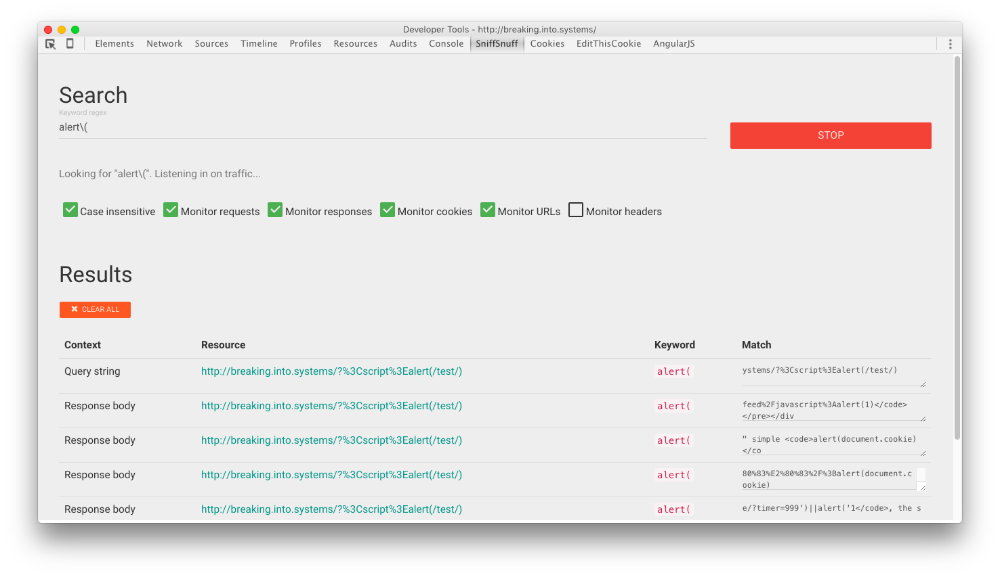

# SniffSnuff

SniffSnuff is a simple Google Chrome developer tools extension that helps monitor network requests as they are dispatched or returned back. SniffSnuff *is not a tamper tool* in the first place. The aim was to have a handy tool to see if canaries leak somewhere in the webapp code while testing for vulnerabilities. For example, a part of query string might end up in the Javascript code returned with the response body and even make an XMLHttpRequest containing it. This is exactly where SniffSnuff comes in. Useful for web application analysis without firing up Burp or ZAP. No proxy hastle and scope madness.

## Looks

## Options
There are options to look for canaries in request/response URLs, cookies, headers and request/response body.

| Option            	| Purpose                                                                                                                 	|
|-------------------	|-------------------------------------------------------------------------------------------------------------------------	|
| Case insensitive  	| The keyword search is case-sensitive by default                                                                         	|
| Monitor requests  	| Look for keyword in request from the browser to the server                                                              	|
| Monitor responses 	| Look for keyword in response body from the server to the browser                                                        	|
| Monitor cookies   	| Look for keyword in cookies sent or received                                                                            	|
| Monitor URLs      	| Look for keyword in the request URLs (e.g. XMLHttpRequest)                                                              	|
| Monitor headers   	| Look for keyword among headers (request or response – depends on the "Monitor requests" and "Monitor responses" options 	|

# Installation

Two ways:
1. Go to `chrome://extensions` and enable the *developer mode* if not yet done. Hit the "Load unpacked extension" button and provide the path to the sources of the master branch

2. Go to `chrome://extensions` and drag-n-drop the .crx build from the `release` branch, `build` directory.

# MIT License
Copyright (c) 2015 Netcat (@0xBADCA7)

Permission is hereby granted, free of charge, to any person obtaining a copy
of this software and associated documentation files (the "Software"), to deal
in the Software without restriction, including without limitation the rights
to use, copy, modify, merge, publish, distribute, sublicense, and/or sell
copies of the Software, and to permit persons to whom the Software is
furnished to do so, subject to the following conditions:

The above copyright notice and this permission notice shall be included in
all copies or substantial portions of the Software.

THE SOFTWARE IS PROVIDED "AS IS", WITHOUT WARRANTY OF ANY KIND, EXPRESS OR
IMPLIED, INCLUDING BUT NOT LIMITED TO THE WARRANTIES OF MERCHANTABILITY,
FITNESS FOR A PARTICULAR PURPOSE AND NONINFRINGEMENT.  IN NO EVENT SHALL THE
AUTHORS OR COPYRIGHT HOLDERS BE LIABLE FOR ANY CLAIM, DAMAGES OR OTHER
LIABILITY, WHETHER IN AN ACTION OF CONTRACT, TORT OR OTHERWISE, ARISING FROM,
OUT OF OR IN CONNECTION WITH THE SOFTWARE OR THE USE OR OTHER DEALINGS IN
THE SOFTWARE.

